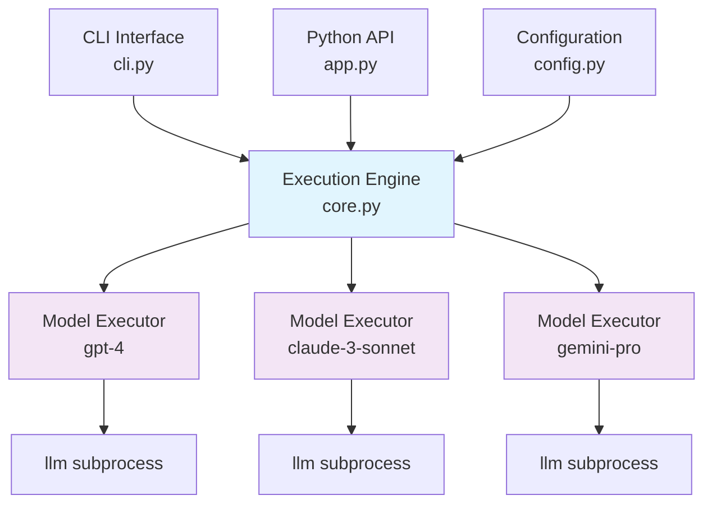
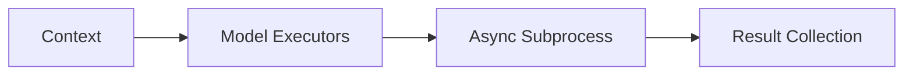
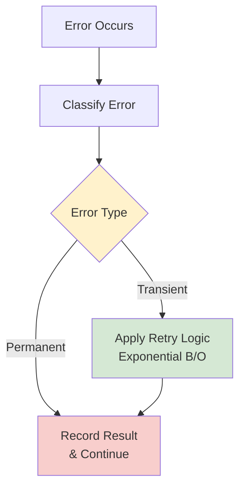
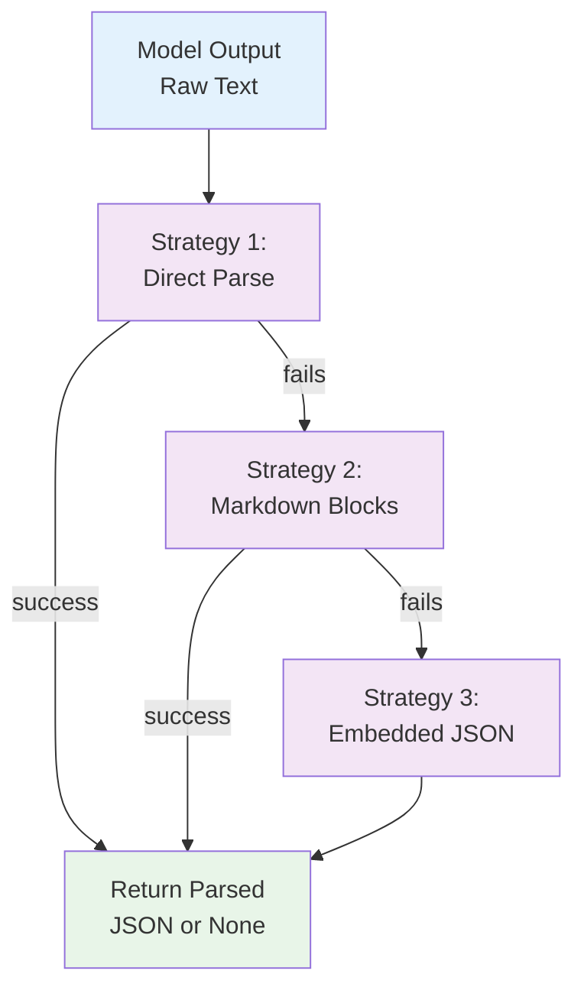
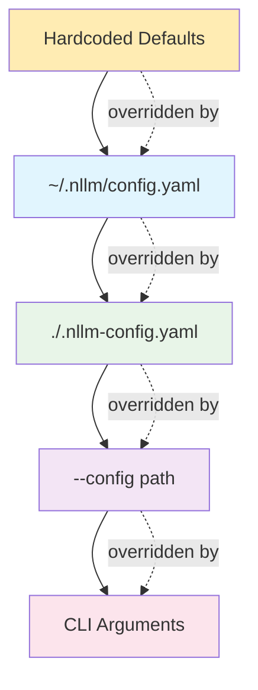

# nllm Architecture

## Overview

nllm is a multi-model fan-out wrapper for the `llm` CLI tool that executes the same prompt across multiple AI models concurrently. The architecture is built around async subprocess execution with structured output management.

## System Architecture



## Core Components

### 1. CLI Interface (`cli.py`)
- **Purpose**: Command-line argument parsing and validation
- **Technology**: Typer for type-safe CLI construction
- **Responsibilities**:
  - Parse CLI arguments with validation
  - Handle version display and help text
  - Forward arguments to main application logic
  - Support both flag-based and positional arguments

### 2. Python API (`app.py`)
- **Purpose**: Public API and orchestration layer
- **Technology**: Pure Python with type hints
- **Responsibilities**:
  - Provide `nllm.run()` public API function
  - Coordinate between configuration, execution, and output
  - Handle high-level error management
  - Manage temporary vs persistent output directories

### 3. Execution Engine (`core.py`)
- **Purpose**: Async subprocess execution and coordination
- **Technology**: `asyncio` with subprocess management
- **Components**:
  - `ModelExecutor`: Handles single model execution
  - `NllmExecutor`: Orchestrates multiple model executors
- **Key Features**:
  - Concurrent execution with semaphore-based throttling
  - Real-time streaming output with model prefixes
  - Per-model timeout and retry handling
  - Live progress table with rich terminal output

### 4. Configuration Management (`config.py`)
- **Purpose**: Configuration loading and resolution
- **Technology**: PyYAML with custom validation
- **Features**:
  - Hierarchical config file precedence
  - Per-model option support
  - CLI argument merging
  - Schema validation

### 5. Data Models (`models.py`)
- **Purpose**: Type-safe data structures
- **Technology**: Python dataclasses with type hints
- **Models**:
  - `ModelResult`: Individual model execution result
  - `NllmResults`: Complete run results
  - `RunManifest`: Execution metadata
  - `ModelConfig`: Model configuration with options
  - `ExecutionContext`: Runtime execution context

### 6. Utilities (`utils.py`)
- **Purpose**: Shared functionality and helpers
- **Key Features**:
  - JSON extraction with multiple strategies
  - Error classification (transient vs permanent)
  - Retry logic with exponential backoff
  - File system operations
  - Command construction and argument handling

## Data Flow

### 1. Initialization Flow


1. **CLI Parsing**: Typer parses command line arguments
2. **Config Loading**: Load and merge config files with CLI overrides
3. **Model Resolution**: Resolve final model list with per-model options
4. **Context Creation**: Build execution context with all parameters

### 2. Execution Flow



1. **Executor Creation**: Create `NllmExecutor` with context
2. **Model Distribution**: Spawn `ModelExecutor` instances per model
3. **Concurrent Execution**: Run models with semaphore throttling
4. **Result Collection**: Gather results and generate artifacts

### 3. Output Flow


1. **Result Processing**: Extract JSON from model outputs
2. **Artifact Generation**: Create manifest, JSONL, and individual files
3. **Summary Display**: Show execution summary with progress table

## Concurrency Model

### Async Architecture
- **Base**: Python `asyncio` event loop
- **Subprocess**: `asyncio.create_subprocess_exec` for model execution
- **Throttling**: `asyncio.Semaphore(4)` for concurrency control
- **Streaming**: Async line-by-line output reading

### Resource Management
```python
# Semaphore-based throttling
semaphore = asyncio.Semaphore(4)  # Max 4 concurrent models

# Per-executor timeout
async with asyncio.timeout(context.config.timeout):
    result = await model_executor.execute()
```

## Error Handling Strategy

### Error Classification



### Error Types
- **Transient**: Network timeouts, rate limits, service unavailable
- **Permanent**: Invalid models, auth failures, bad requests
- **Timeouts**: Process-level timeouts with graceful cleanup

### Retry Strategy
- **Algorithm**: Exponential backoff with jitter
- **Max Retries**: Configurable per execution (default: 0)
- **Base Delay**: 1.0 seconds
- **Max Delay**: 60 seconds

## JSON Extraction Architecture

### Multi-Strategy Approach



### Implementation Layers
1. **Direct Parsing**: Try `json.loads()` on raw text
2. **Markdown Extraction**: Parse `\`\`\`json` code blocks
3. **Embedded Detection**: Find JSON objects/arrays in larger text

## File System Organization

### Output Structure
```
./nllm-runs/<timestamp>/
├── manifest.json           # Run metadata
├── results.jsonl          # JSONL results (one per model)
├── results/               # Individual model results
│   ├── <model1>.json
│   ├── <model2>.json
│   └── ...
└── raw/                   # Raw outputs (if --raw flag)
    ├── <model1>.stdout.txt
    ├── <model1>.stderr.txt
    └── ...
```

### Atomic Operations
- **Safe Writes**: Use temporary files with atomic moves
- **Directory Creation**: Ensure parent directories exist
- **Cleanup**: Automatic cleanup of temporary directories

## Configuration System

### Hierarchical Resolution



### Per-Model Options
```yaml
models:
  - "gpt-4"  # Simple string
  - name: "claude-3-sonnet"  # Object with options
    options: ["-o", "temperature", "0.2"]
```

Merged with CLI `--model-option` flags:
```bash
--model-option claude-3-sonnet:--system:"Be helpful"
```

## Security Considerations

### Credential Handling
- **No Direct Access**: Never read or store API keys
- **Delegation**: Rely on `llm` for authentication
- **Redaction**: Hide potential secrets in logs and manifest

### Process Security
- **Subprocess Isolation**: Each model runs in separate subprocess
- **Resource Limits**: Timeout and memory constraints
- **Signal Handling**: Graceful shutdown on interruption

## Performance Characteristics

### Scalability
- **Concurrent Models**: Efficiently handles 10+ models
- **Memory Usage**: Linear with number of models
- **I/O Bound**: Network requests are the bottleneck

### Optimizations
- **Semaphore Throttling**: Prevents overwhelming target APIs
- **Streaming Output**: Immediate feedback without buffering
- **Async I/O**: Non-blocking file operations

## Extension Points

### Future Enhancements
1. **Plugin System**: Custom output processors
2. **Result Comparison**: Side-by-side model comparison
3. **Batch Processing**: Multiple prompts across models
4. **Cost Tracking**: Enhanced usage analytics
5. **Caching**: Result caching for repeated prompts

### API Stability
- **Public API**: `nllm.run()` function with stable interface
- **Data Models**: Versioned schema for artifacts
- **Configuration**: Backward-compatible config format