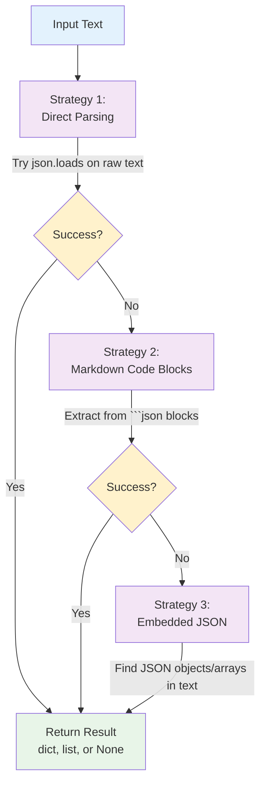

# JSON Extraction System

## Overview

nllm includes a comprehensive JSON extraction system that automatically detects and parses JSON content from model outputs. This enables structured data processing even when models return JSON embedded in natural language responses.

## Architecture

### Multi-Strategy Approach

The JSON extraction system uses a three-layer approach to maximize the chances of successful JSON detection:



## Implementation Details

### Core Function

```python
def extract_json_from_text(text: str) -> dict | list | None:
    """Extract JSON from text using multiple strategies.

    Strategies:
    1. Direct JSON parsing - try to parse the entire text as JSON
    2. Markdown code blocks - look for ```json or ``` blocks
    3. Embedded JSON detection - find JSON objects/arrays within text

    Returns:
        dict | list | None: Parsed JSON object/array, or None if not found
    """
```

### Strategy 1: Direct Parsing

Attempts to parse the entire input as JSON after normalizing whitespace:

```python
def is_likely_json(text: str) -> bool:
    """Check if text looks like JSON without parsing."""
    text = text.strip()
    return (text.startswith('{') and text.endswith('}')) or \
           (text.startswith('[') and text.endswith(']'))

def parse_json_safely(text: str) -> dict | list | None:
    """Safely parse JSON text."""
    try:
        return json.loads(text)
    except (json.JSONDecodeError, ValueError):
        return None

# Strategy 1 implementation
if is_likely_json(text):
    result = parse_json_safely(text)
    if result is not None:
        return result
```

**Handles:**
- Raw JSON objects: `{"key": "value"}`
- Raw JSON arrays: `[1, 2, 3]`
- JSON with leading/trailing whitespace

### Strategy 2: Markdown Code Block Extraction

Extracts JSON from markdown-style code blocks using regex patterns:

```python
# Regex patterns for different markdown formats
patterns = [
    r"```(?:json|JSON)?\s*\n([\s\S]*?)\n```",  # ```json or ``` with content
    r"`([^`]+)`",                               # Single backticks `{...}`
]

for pattern in patterns:
    matches = re.findall(pattern, text)
    for match in matches:
        candidate = match.strip()
        if is_likely_json(candidate):
            result = parse_json_safely(candidate)
            if result is not None:
                return result
```

**Handles:**
- Standard JSON blocks: ````json\n{...}\n````
- Language-free blocks: ````\n{...}\n````
- Case variations: ````JSON\n{...}\n````
- Single backticks: `` `{"key": "value"}` ``

### Strategy 3: Embedded JSON Detection

Finds JSON objects and arrays embedded within larger text using bracket matching:

```python
def find_json_boundaries(text: str, start_char: str, end_char: str) -> list[str]:
    """Find balanced bracket sequences in text."""
    candidates = []

    for i, char in enumerate(text):
        if char == start_char:
            depth = 1
            start = i

            for j in range(i + 1, len(text)):
                if text[j] == start_char:
                    depth += 1
                elif text[j] == end_char:
                    depth -= 1
                    if depth == 0:
                        candidates.append(text[start:j + 1])
                        break

    return candidates

# Find JSON objects and arrays
for candidate in find_json_boundaries(text, "{", "}"):
    result = parse_json_safely(candidate)
    if result is not None:
        return result

for candidate in find_json_boundaries(text, "[", "]"):
    result = parse_json_safely(candidate)
    if result is not None:
        return result
```

**Handles:**
- Embedded objects: `The result is {"status": "ok"} as shown.`
- Embedded arrays: `Here are the items: [1, 2, 3] for processing.`
- Nested structures with balanced brackets
- Multiple JSON candidates (returns first valid)

## Use Cases and Examples

### Use Case 1: Direct JSON Response

**Input:**
```
{"status": "success", "data": [1, 2, 3]}
```

**Strategy:** Direct parsing (Strategy 1)
**Output:**
```python
{
    "status": "success",
    "data": [1, 2, 3]
}
```

### Use Case 2: Markdown Code Block

**Input:**
```
Here's the data you requested:

```json
{
  "results": ["item1", "item2"],
  "count": 2
}
```

Let me know if you need more information.
```

**Strategy:** Markdown extraction (Strategy 2)
**Output:**
```python
{
    "results": ["item1", "item2"],
    "count": 2
}
```

### Use Case 3: Embedded in Natural Language

**Input:**
```
Based on my analysis, the results show {"confidence": 0.95, "prediction": "positive"} which indicates a high degree of certainty.
```

**Strategy:** Embedded detection (Strategy 3)
**Output:**
```python
{
    "confidence": 0.95,
    "prediction": "positive"
}
```

### Use Case 4: Complex Nested Structure

**Input:**
```
The API response structure would be:

```json
{
  "users": [
    {"id": 1, "name": "Alice", "active": true},
    {"id": 2, "name": "Bob", "active": false}
  ],
  "metadata": {
    "total": 2,
    "page": 1
  }
}
```
```

**Strategy:** Markdown extraction (Strategy 2)
**Output:**
```python
{
    "users": [
        {"id": 1, "name": "Alice", "active": True},
        {"id": 2, "name": "Bob", "active": False}
    ],
    "metadata": {
        "total": 2,
        "page": 1
    }
}
```

## Error Handling and Edge Cases

### Invalid JSON Handling

The system gracefully handles invalid JSON at each strategy level:

```python
# Each strategy includes safe parsing
def parse_json_safely(text: str) -> dict | list | None:
    try:
        return json.loads(text)
    except (json.JSONDecodeError, ValueError):
        return None  # Continue to next strategy
```

**Edge cases handled:**
- Malformed JSON syntax
- Incomplete JSON (truncated responses)
- JSON with comments (not valid JSON)
- Empty strings or whitespace-only text

### Multiple JSON Objects

When multiple valid JSON objects are found, the system returns the first valid one:

```python
# Text with multiple JSON objects
text = 'First: {"a": 1} and second: {"b": 2}'

# Returns: {"a": 1} (first valid JSON found)
```

### Complex Nesting

The bracket matching algorithm correctly handles nested structures:

```python
# Correctly parses nested objects
text = 'Result: {"outer": {"inner": {"value": 42}}} done'

# Returns: {"outer": {"inner": {"value": 42}}}
```

### Non-JSON Content

Returns `None` for content that doesn't contain valid JSON:

```python
extract_json_from_text("This is just regular text.")  # Returns None
extract_json_from_text("```\nsome code but not JSON\n```")  # Returns None
```

## Integration with Model Results

### Automatic Extraction

JSON extraction is automatically applied to every model result:

```python
# In core.py ModelExecutor._run_model()
stdout_data, stderr_data = await self._stream_output(...)

# Extract JSON from the output text
extracted_json = extract_json_from_text(stdout_data)

return ModelResult(
    model=self.model,
    status="ok",
    # ... other fields
    text=stdout_data,
    json=extracted_json,  # Automatically extracted
)
```

### Result Structure

The extracted JSON is stored in the `json` field of `ModelResult`:

```python
@dataclass
class ModelResult:
    # ... other fields
    json: dict[str, Any] | list | None = None

    def to_dict(self) -> dict[str, Any]:
        return {
            # ... other fields
            "json": self.json,  # Included in serialized output
        }
```

### JSONL Output

The extracted JSON is included in all output formats:

```json
{
  "model": "gpt-4",
  "status": "ok",
  "text": "```json\n{\"result\": \"success\"}\n```",
  "json": {"result": "success"}
}
```

## Performance Considerations

### Strategy Ordering

Strategies are ordered by performance:
1. **Direct parsing**: Fastest (single `json.loads()` call)
2. **Markdown extraction**: Medium (regex + parsing)
3. **Embedded detection**: Slowest (bracket matching + multiple parse attempts)

### Early Termination

The system stops at the first successful extraction:

```python
# If direct parsing succeeds, skip other strategies
if is_likely_json(text):
    result = parse_json_safely(text)
    if result is not None:
        return result  # Early termination

# Only continue if direct parsing failed
# ... continue with markdown extraction
```

### Regex Optimization

Markdown extraction uses compiled regex patterns for efficiency:

```python
# Pre-compiled patterns for better performance
JSON_BLOCK_PATTERNS = [
    re.compile(r"```(?:json|JSON)?\s*\n([\s\S]*?)\n```"),
    re.compile(r"`([^`]+)`"),
]
```

## Testing Strategy

### Comprehensive Test Coverage

The JSON extraction system includes extensive tests covering all strategies:

```python
class TestExtractJsonFromText:
    def test_extract_raw_json_object(self):
        """Test direct JSON object parsing."""

    def test_extract_json_from_markdown_code_block(self):
        """Test markdown code block extraction."""

    def test_extract_json_embedded_in_text(self):
        """Test embedded JSON detection."""

    def test_no_json_found(self):
        """Test handling of non-JSON content."""

    def test_invalid_json_in_code_block(self):
        """Test graceful handling of invalid JSON."""
```

### Edge Case Testing

Tests include challenging edge cases:
- Nested JSON with unbalanced quotes
- JSON with unicode characters
- Very large JSON objects
- Multiple JSON objects in one text
- JSON arrays vs objects
- Empty and whitespace-only inputs

## Configuration and Customization

### Future Extensions

The system is designed to support future customization:

```python
# Potential future configuration options
@dataclass
class JsonExtractionConfig:
    max_depth: int = 10              # Maximum nesting depth
    max_size: int = 1024 * 1024     # Maximum JSON size (1MB)
    strategies: list[str] = field(default_factory=lambda: [
        "direct", "markdown", "embedded"
    ])
    strict_mode: bool = False        # Only extract if high confidence
```

### Custom Extractors

The architecture supports pluggable extraction strategies:

```python
def register_custom_extractor(name: str, extractor: Callable[[str], Any]):
    """Register a custom JSON extraction strategy."""
    # Future implementation for extensibility
```

## Best Practices

### Model Prompt Engineering

To maximize JSON extraction success, consider these prompting strategies:

1. **Explicit JSON requests:**
   ```
   "Please return your response as JSON with the following structure: {...}"
   ```

2. **Markdown formatting requests:**
   ```
   "Format your JSON response in a markdown code block."
   ```

3. **Clear delimiters:**
   ```
   "Begin your JSON response after 'JSON:' and end before 'DONE'"
   ```

### Error Recovery

Always check for JSON extraction results:

```python
result = results.get_result("gpt-4")
if result and result.json:
    # Process structured data
    data = result.json
    print(f"Status: {data.get('status', 'unknown')}")
else:
    # Fall back to text processing
    text = result.text if result else ""
    # ... handle as plain text
```

## Limitations and Trade-offs

### Current Limitations

1. **Single JSON per response**: Returns only the first valid JSON found
2. **No streaming extraction**: Processes complete text only
3. **Limited format support**: Focuses on JSON, not other structured formats
4. **Performance cost**: Multiple parsing attempts for complex text

### Design Trade-offs

1. **Accuracy vs Performance**: Comprehensive extraction vs speed
2. **Flexibility vs Complexity**: Multiple strategies vs simple parsing
3. **Robustness vs Strictness**: Forgiving parsing vs strict validation

These trade-offs prioritize successful extraction and user experience over raw performance.