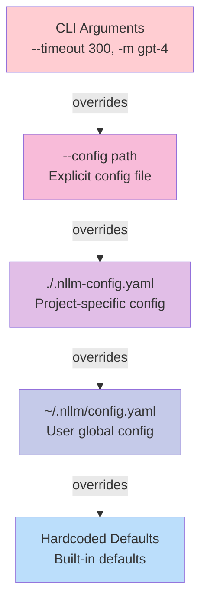

# Configuration System

## Overview

nllm uses a hierarchical configuration system that combines YAML files, CLI arguments, and defaults to provide flexible and user-friendly configuration management. The system supports both simple and advanced configuration patterns.

## Configuration Hierarchy

### Precedence Chain

Configuration values are resolved using the following precedence (highest to lowest):



### File Location Resolution

```python
def find_config_file(explicit_path: str | None = None) -> Path | None:
    """Find the configuration file using precedence rules."""
    # 1. Explicit path from CLI
    if explicit_path:
        path = Path(explicit_path)
        if not path.exists():
            raise ConfigError(f"Specified config file not found: {path}")
        return path

    # 2. Check default locations in order
    CONFIG_FILES = [
        Path("./.nllm-config.yaml"),      # Current directory
        Path("~/.nllm/config.yaml"),     # Home directory
    ]

    for config_path in CONFIG_FILES:
        if config_path.expanduser().exists():
            return config_path.expanduser()

    return None
```

## Configuration Schema

### YAML Structure

```yaml
# nllm configuration file

# Model definitions (supports both formats)
models:
  # Simple string format
  - "gpt-4"
  - "claude-3-sonnet"

  # Advanced format with per-model options
  - name: "gemini-pro"
    options: ["-o", "temperature", "0.8"]
  - name: "claude-3-opus"
    options: ["--system", "You are a helpful assistant"]

# Default execution settings
defaults:
  timeout: 120          # Per-model timeout in seconds
  retries: 1           # Retry attempts for transient failures
  stream: true         # Enable streaming output
  outdir: "./my-runs"  # Output directory

# Optional: Cost tracking estimates
costs:
  gpt-4:
    input_per_1k: 0.03
    output_per_1k: 0.06
  claude-3-sonnet:
    input_per_1k: 0.003
    output_per_1k: 0.015
```

### Data Model Mapping

The YAML structure maps to the following Python data models:

```python
@dataclass
class NllmConfig:
    models: list[ModelConfig] = field(default_factory=list)
    timeout: int = 120
    retries: int = 0
    stream: bool = True
    outdir: str = "./nllm-runs"
    costs: dict[str, dict[str, float]] = field(default_factory=dict)

@dataclass
class ModelConfig:
    name: str
    options: list[str] = field(default_factory=list)
```

## Model Configuration

### Simple Format

The simplest way to specify models is as strings:

```yaml
models:
  - "gpt-4"
  - "claude-3-sonnet"
  - "gemini-pro"
```

This creates `ModelConfig` objects with empty options lists.

### Advanced Format

For models requiring specific options:

```yaml
models:
  - name: "gpt-4"
    options: ["-o", "temperature", "0.2"]
  - name: "claude-3-sonnet"
    options: ["--system", "You are a concise assistant"]
  - name: "gemini-pro"
    options: ["-o", "temperature", "0.8", "--system", "Be creative"]
```

### Mixed Format Support

You can combine both formats in the same configuration:

```yaml
models:
  - "gpt-4"  # Simple
  - name: "claude-3-sonnet"  # Advanced
    options: ["--system", "Be helpful"]
  - "gemini-pro"  # Simple
```

## Per-Model Options

### Configuration File Options

Per-model options in configuration files are specified as lists:

```yaml
models:
  - name: "gpt-4"
    options: [
      "-o", "temperature", "0.2",
      "--system", "You are precise and analytical",
      "--max-tokens", "1000"
    ]
```

### CLI Per-Model Options

The `--model-option` flag allows specifying options for specific models:

```bash
nllm -m gpt-4 -m claude-3-sonnet \
  --model-option gpt-4:-o:temperature:0.2 \
  --model-option claude-3-sonnet:--system:"Be creative" \
  -- "Write a story"
```

#### Format Specification

```
--model-option <model_name>:<option1>:<option2>:...
```

**Examples:**
```bash
# Set temperature
--model-option gpt-4:-o:temperature:0.7

# Set system prompt
--model-option claude-3-sonnet:--system:"You are helpful"

# Multiple options
--model-option gpt-4:-o:temperature:0.2:--max-tokens:500

# Multiple model-option flags
--model-option gpt-4:-o:temperature:0.2
--model-option claude-3-sonnet:-o:temperature:0.8
```

### Option Merging

CLI options are **appended** to configuration file options:

```yaml
# Configuration file
models:
  - name: "gpt-4"
    options: ["-o", "temperature", "0.5"]
```

```bash
# CLI command
nllm --model-option gpt-4:--system:"Be helpful" -- "Hello"
```

**Resulting command:**
```bash
llm -m gpt-4 -o temperature 0.5 --system "Be helpful" "Hello"
```

## Default Values

### Built-in Defaults

```python
DEFAULT_TIMEOUT = 120      # seconds
DEFAULT_RETRIES = 0        # no retries by default
DEFAULT_STREAM = True      # enable streaming
DEFAULT_OUTDIR = "./nllm-runs"  # output directory
```

### Default Override Cascade

```python
def get_effective_config() -> NllmConfig:
    """Get the final effective configuration."""
    # Start with hardcoded defaults
    config = NllmConfig()

    # Apply config file values
    if config_file_found:
        file_config = load_yaml_config(config_file)
        config = merge_configs(config, file_config)

    # Apply CLI overrides
    if cli_args_provided:
        config = apply_cli_overrides(config, cli_args)

    return config
```

## Configuration Loading

### YAML Parsing

```python
def load_yaml_file(file_path: Path) -> dict:
    """Load and parse a YAML configuration file."""
    try:
        with file_path.open("r", encoding="utf-8") as f:
            content = yaml.safe_load(f) or {}
            if not isinstance(content, dict):
                raise ConfigError(f"Config file must contain a YAML object: {file_path}")
            return content
    except yaml.YAMLError as e:
        raise ConfigError(f"Invalid YAML in config file {file_path}: {e}") from e
    except FileNotFoundError:
        raise ConfigError(f"Config file not found: {file_path}") from None
```

### Model List Resolution

```python
@classmethod
def from_dict(cls, data: dict[str, Any]) -> NllmConfig:
    """Create config from dictionary (loaded from YAML)."""
    raw_models = data.get("models", [])
    models = []

    for item in raw_models:
        if isinstance(item, str):
            # Simple string format
            models.append(ModelConfig.from_string(item))
        elif isinstance(item, dict):
            # Advanced object format
            models.append(ModelConfig.from_dict(item))
        else:
            raise ValueError(f"Invalid model configuration: {item}")

    return cls(
        models=models,
        timeout=data.get("defaults", {}).get("timeout", DEFAULT_TIMEOUT),
        retries=data.get("defaults", {}).get("retries", DEFAULT_RETRIES),
        stream=data.get("defaults", {}).get("stream", DEFAULT_STREAM),
        outdir=data.get("defaults", {}).get("outdir", DEFAULT_OUTDIR),
        costs=data.get("costs", {}),
    )
```

### CLI Integration

```python
def merge_cli_config(
    config: NllmConfig,
    cli_models: list[str] | None = None,
    cli_model_options: list[str] | None = None,
    cli_timeout: int | None = None,
    cli_retries: int | None = None,
    cli_stream: bool | None = None,
    cli_outdir: str | None = None,
) -> NllmConfig:
    """Merge CLI arguments into configuration."""

    # Resolve models with per-model options
    resolved_models = resolve_models(cli_models, cli_model_options or [], config)

    return config.merge_cli_args(
        models=resolved_models,
        timeout=cli_timeout,
        retries=cli_retries,
        stream=cli_stream,
        outdir=cli_outdir,
    )
```

## Validation

### Configuration Validation

```python
def validate_config(config: NllmConfig) -> None:
    """Validate configuration values."""
    if config.timeout < 1:
        raise ConfigError("timeout must be at least 1 second")

    if config.retries < 0:
        raise ConfigError("retries cannot be negative")

    if not config.outdir:
        raise ConfigError("outdir cannot be empty")

    # Validate model configurations
    for model in config.models:
        if not model.name:
            raise ConfigError("model name cannot be empty")
```

### CLI Option Parsing

```python
def parse_cli_model_options(model_options: list[str]) -> dict[str, list[str]]:
    """Parse CLI model options from --model-option flags.

    Format: model_name:option1:option2:...
    Returns dict mapping model names to their option lists.
    """
    result = {}
    for option_spec in model_options:
        if ":" not in option_spec:
            raise ConfigError(
                f"Invalid model option format: {option_spec}. "
                f"Expected format: model:option1:option2:..."
            )

        parts = option_spec.split(":")
        model_name = parts[0]
        options = parts[1:] if len(parts) > 1 else []

        if model_name in result:
            result[model_name].extend(options)
        else:
            result[model_name] = options

    return result
```

## Configuration Examples

### Basic Configuration

```yaml
# .nllm-config.yaml
models:
  - "gpt-4"
  - "claude-3-sonnet"

defaults:
  timeout: 180
  retries: 1
  outdir: "./results"
```

### Advanced Configuration with Per-Model Options

```yaml
# .nllm-config.yaml
models:
  - name: "gpt-4"
    options: ["-o", "temperature", "0.2", "--system", "You are precise"]

  - name: "claude-3-sonnet"
    options: ["-o", "temperature", "0.7", "--system", "You are creative"]

  - name: "gemini-pro"
    options: ["-o", "temperature", "0.5"]

defaults:
  timeout: 300
  retries: 2
  stream: true
  outdir: "./nllm-outputs"

# Cost tracking (optional)
costs:
  gpt-4:
    input_per_1k: 0.03
    output_per_1k: 0.06
  claude-3-sonnet:
    input_per_1k: 0.003
    output_per_1k: 0.015
  gemini-pro:
    input_per_1k: 0.0005
    output_per_1k: 0.0015
```

### Project-Specific Configuration

```yaml
# ./project/.nllm-config.yaml
models:
  - name: "gpt-4"
    options: ["--system", "You are a code review assistant"]

  - name: "claude-3-sonnet"
    options: ["--system", "You are a documentation writer"]

defaults:
  timeout: 240
  outdir: "./code-review-results"
  stream: false  # Quiet mode for CI/CD
```

## Environment Integration

### Environment Variable Support

While nllm doesn't directly read environment variables for configuration, it integrates with the `llm` tool's environment handling:

```bash
# llm tool will use these environment variables
export OPENAI_API_KEY="your-key"
export ANTHROPIC_API_KEY="your-key"

# nllm inherits this environment
nllm -m gpt-4 -m claude-3-sonnet -- "Hello"
```

### Working Directory Context

Configuration files are resolved relative to the current working directory:

```bash
# Different behavior based on current directory
cd /project/a && nllm -- "Task A"  # Uses /project/a/.nllm-config.yaml
cd /project/b && nllm -- "Task B"  # Uses /project/b/.nllm-config.yaml
```

## Configuration Generation

### Example Config Creation

```python
def create_example_config() -> str:
    """Create an example configuration file content."""
    return """# nllm configuration file
# This file configures default behavior for the nllm CLI

# List of models to use if none specified on command line
models:
  - "gpt-4"  # Simple format
  - name: "claude-3-sonnet"  # With per-model options
    options: ["-o", "temperature", "0.2", "--system", "You are concise"]
  - name: "gemini-pro"
    options: ["-o", "temperature", "0.8"]

# Default settings
defaults:
  timeout: 120         # Per-model timeout in seconds
  retries: 0          # Per-model retries for transient errors
  stream: true        # Stream outputs to console
  outdir: "./nllm-out"  # Base output directory

# Optional: Cost tracking per model (estimates)
costs:
  gpt-4:
    input_per_1k: 0.03
    output_per_1k: 0.06
  claude-3-sonnet:
    input_per_1k: 0.003
    output_per_1k: 0.015
"""
```

### Configuration File Creation

```bash
# Create project-specific config
cat > .nllm-config.yaml << 'EOF'
models:
  - "gpt-4"
  - "claude-3-sonnet"

defaults:
  timeout: 180
  retries: 1
EOF

# Create user global config
mkdir -p ~/.nllm
cat > ~/.nllm/config.yaml << 'EOF'
models:
  - "gpt-4"
  - "claude-3-sonnet"
  - "gemini-pro"

defaults:
  timeout: 120
  outdir: "~/nllm-results"
EOF
```

## Error Handling

### Common Configuration Errors

```python
# File not found
ConfigError: Specified config file not found: /path/to/config.yaml

# Invalid YAML syntax
ConfigError: Invalid YAML in config file config.yaml: while parsing a block mapping...

# Invalid model option format
ConfigError: Invalid model option format: gpt4-temp-0.2. Expected format: model:option1:option2:...

# Validation errors
ConfigError: timeout must be at least 1 second
ConfigError: retries cannot be negative
```

### Graceful Degradation

```python
def load_config(explicit_path: str | None = None) -> tuple[NllmConfig, list[str]]:
    """Load configuration with graceful error handling."""
    config_files_used = []

    try:
        config_file = find_config_file(explicit_path)
        if config_file:
            config_data = load_yaml_file(config_file)
            config_files_used.append(str(config_file))
            return NllmConfig.from_dict(config_data), config_files_used
    except ConfigError:
        # If explicit path was given, re-raise the error
        if explicit_path:
            raise
        # Otherwise, continue with defaults (graceful degradation)

    # No config file found or failed to load - use defaults
    return NllmConfig(), config_files_used
```

## Best Practices

### Configuration Management

1. **Project-specific configs**: Use `.nllm-config.yaml` for project requirements
2. **User defaults**: Use `~/.nllm/config.yaml` for personal preferences
3. **Explicit overrides**: Use `--config` for one-off custom configurations
4. **CLI overrides**: Use CLI flags for temporary changes

### Model Options

1. **Consistent formatting**: Use consistent temperature and system prompt patterns
2. **Documentation**: Comment complex model option configurations
3. **Testing**: Test model options with `--dry-run` before execution
4. **Validation**: Validate that model-specific options work with intended models

### Security

1. **No secrets**: Never store API keys in configuration files
2. **Path validation**: Be careful with relative paths in `outdir`
3. **File permissions**: Ensure configuration files have appropriate permissions

```bash
# Secure configuration file permissions
chmod 600 ~/.nllm/config.yaml
```

## Future Extensions

### Planned Features

1. **Configuration validation**: `nllm config validate`
2. **Configuration generation**: `nllm config init`
3. **Configuration profiles**: Multiple named configurations
4. **Environment variable interpolation**: `${ENV_VAR}` support in configs

### Extension Points

The configuration system is designed to support:
- Custom configuration validators
- Plugin-based configuration extensions
- Dynamic configuration loading
- Configuration caching and optimization