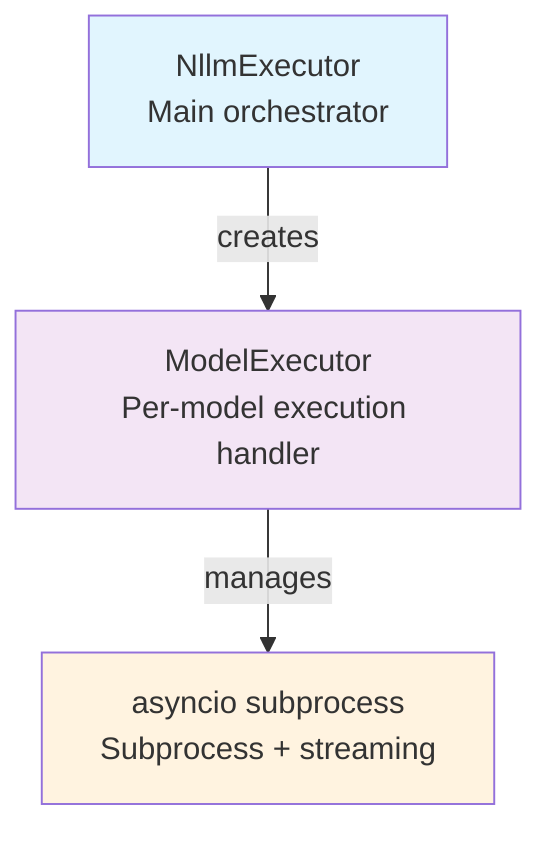
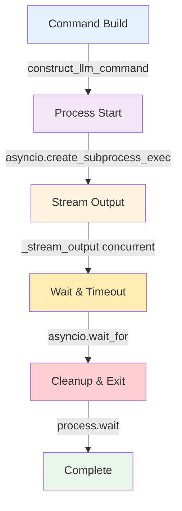

# Async Execution Engine

## Overview

nllm's execution engine is built around Python's `asyncio` framework, enabling efficient concurrent execution of multiple `llm` subprocess calls. The system provides controlled concurrency, real-time streaming, timeout management, and robust error handling.

## Architecture

### Core Components



### Class Hierarchy

```python
class NllmExecutor:
    """Main executor that orchestrates multiple model runs."""
    def __init__(self, context: ExecutionContext)
    async def execute_all(self) -> list[ModelResult]
    def print_summary(self) -> None
    def get_exit_code(self) -> int

class ModelExecutor:
    """Handles execution of a single model."""
    def __init__(self, model_config: ModelConfig, context: ExecutionContext, console: Console)
    async def execute(self) -> ModelResult
    async def _run_model(self) -> ModelResult
    async def _stream_output(self, process, stdout_file, stderr_file) -> tuple[str, str]
```

## Concurrency Control

### Semaphore-Based Throttling

The system uses an `asyncio.Semaphore` to limit concurrent model executions:

```python
class NllmExecutor:
    async def execute_all(self) -> list[ModelResult]:
        # Fixed concurrency limit (removed configurable parallel option)
        semaphore = asyncio.Semaphore(4)  # Max 4 concurrent models

        async def run_single_model(model_config: ModelConfig) -> ModelResult:
            async with semaphore:
                executor = ModelExecutor(model_config, self.context, self.console)
                return await executor.execute()

        # Execute all models with semaphore throttling
        tasks = [run_single_model(model) for model in self.context.config.models]
        self.results = await asyncio.gather(*tasks, return_exceptions=False)
```

### Concurrency Benefits

1. **Resource Management**: Prevents overwhelming target APIs
2. **Memory Control**: Limits concurrent subprocess memory usage
3. **Rate Limiting**: Respects API provider rate limits
4. **System Stability**: Avoids excessive file descriptor usage

## Subprocess Management

### Process Creation

```python
async def _run_model(self) -> ModelResult:
    """Run the actual model execution."""
    command = construct_llm_command(
        self.model_config.name, self.context.llm_args, self.model_config.options
    )

    # Create process with proper stdio handling
    try:
        process = await asyncio.create_subprocess_exec(
            *command,
            stdout=asyncio.subprocess.PIPE,
            stderr=asyncio.subprocess.PIPE,
            cwd=Path.cwd(),
        )
    except FileNotFoundError:
        raise ExecutionError("llm command not found")
```

### Process Lifecycle



### Timeout Handling

```python
try:
    # Run with timeout
    stdout_data, stderr_data = await asyncio.wait_for(
        self._stream_output(process, stdout_file, stderr_file),
        timeout=self.context.config.timeout,
    )

    # Wait for process to complete
    exit_code = await process.wait()

except TimeoutError:
    # Graceful process termination
    process.terminate()
    try:
        await asyncio.wait_for(process.wait(), timeout=5)
    except TimeoutError:
        # Force kill if terminate fails
        process.kill()
        await process.wait()
    raise TimeoutError()
```

## Streaming Output

### Real-Time Streaming Architecture

```mermaid
flowchart TD
    A[stdout stream] --> C[Console Output<br/>[model] line]
    B[stderr stream] --> C
    A --> D[Raw File Output<br/>if --raw flag]
    B --> D

    style A fill:#e3f2fd
    style B fill:#ffecb3
    style C fill:#e8f5e8
    style D fill:#f3e5f5
```

### Stream Processing Implementation

```python
async def _stream_output(
    self,
    process: asyncio.subprocess.Process,
    stdout_file,
    stderr_file,
) -> tuple[str, str]:
    """Stream output from process, optionally to console and files."""
    stdout_lines = []
    stderr_lines = []

    async def read_stream(stream, lines_list, file_handle, is_stderr=False):
        while True:
            line = await stream.readline()
            if not line:
                break

            line_str = line.decode("utf-8", errors="replace")
            lines_list.append(line_str)

            # Write to file if requested
            if file_handle:
                file_handle.write(line_str)
                file_handle.flush()

            # Stream to console with model prefix
            if (
                self.context.config.stream
                and not self.context.quiet
                and not self.suppress_streaming
            ):
                prefix = f"[{self.model}]"
                if is_stderr:
                    self.console.print(f"{prefix} [red]{line_str.rstrip()}[/red]")
                else:
                    self.console.print(f"{prefix} {line_str.rstrip()}")

    # Read both streams concurrently
    await asyncio.gather(
        read_stream(process.stdout, stdout_lines, stdout_file, False),
        read_stream(process.stderr, stderr_lines, stderr_file, True),
    )

    return "".join(stdout_lines), "".join(stderr_lines)
```

### Output Management

**Console Output Format:**
```
[gpt-4] The answer to your question is...
[claude-3-sonnet] Here's my response...
[gpt-4] Continuing with more details...
[gemini-pro] Based on the analysis...
```

**File Output (if --raw enabled):**
```
./nllm-runs/timestamp/raw/
├── gpt-4.stdout.txt
├── gpt-4.stderr.txt
├── claude-3-sonnet.stdout.txt
├── claude-3-sonnet.stderr.txt
└── ...
```

## Progress Display

### Live Progress Table

The system provides a real-time progress table using the Rich library:

```python
def _create_progress_table(self) -> Table:
    """Create live progress table."""
    table = Table(title="Model Execution Progress", show_lines=True)
    table.add_column("Model", style="cyan", no_wrap=True)
    table.add_column("Status", justify="center", min_width=20)
    table.add_column("Duration", justify="right", min_width=10)

    for model, status in self.model_status.items():
        if status["status"] == "running":
            status_text = Text(f"{STATUS_RUNNING} Running...", style="yellow")
        elif status["status"] == "completed":
            status_text = Text(f"{STATUS_SUCCESS} Completed", style="green")
        elif status["status"] == "timeout":
            status_text = Text(f"{STATUS_TIMEOUT} Timeout", style="red")
        else:
            status_text = Text(f"{STATUS_ERROR} Error", style="red")

        table.add_row(model, status_text, status["duration"])

    return table
```

**Example Progress Display:**
```
                Model Execution Progress
┏━━━━━━━━━━━━━━━━━┳━━━━━━━━━━━━━━━━━━━━━━┳━━━━━━━━━━━┓
┃ Model           ┃        Status        ┃  Duration ┃
┡━━━━━━━━━━━━━━━━━╇━━━━━━━━━━━━━━━━━━━━━━╇━━━━━━━━━━━┩
│ gpt-4           │    ✓ Completed       │     2.4s  │
│ claude-3-sonnet │    ⏳ Running...     │     1.8s  │
│ gemini-pro      │    ❌ Error          │     0.5s  │
└─────────────────┴──────────────────────┴───────────┘
```

### Thread-Safe Updates

```python
async def _run_single_model_with_progress(
    self, model_config: ModelConfig, live, semaphore, update_lock
) -> ModelResult:
    """Run a single model and update progress table."""
    async with semaphore:
        executor = ModelExecutor(
            model_config, self.context, self.console, suppress_streaming=True
        )
        result = await executor.execute()

        # Update status with lock to prevent concurrent updates
        async with update_lock:
            self.model_status[model_config.name] = {
                "status": "completed" if result.status == "ok" else result.status,
                "duration": format_duration(result.duration_ms),
                "result_file": f"results/{sanitize_filename(model_config.name)}.json",
            }

            # Update the live display
            live.update(self._create_progress_table())

        return result
```

## Error Handling

### Error Classification

```python
def classify_error(stderr_data: str) -> bool:
    """Classify if an error is transient (retryable) or permanent."""
    stderr_lower = stderr_data.lower()

    # Transient errors (will retry)
    transient_patterns = [
        "connection timed out",
        "network is unreachable",
        "temporary failure",
        "service unavailable",
        "too many requests",
        "rate limit",
        "502 bad gateway",
        "503 service unavailable",
        "504 gateway timeout",
        "timeout",
    ]

    for pattern in transient_patterns:
        if pattern in stderr_lower:
            return True  # Retryable

    return False  # Permanent error
```

### Retry Logic

```python
async def execute(self) -> ModelResult:
    """Execute the model with retry logic."""
    if self.context.dry_run:
        return self._create_dry_run_result()

    self.start_time = time.time()

    async def _run_with_retry():
        return await self._run_model()

    try:
        if self.context.config.retries > 0:
            result = await retry_with_backoff(
                _run_with_retry,
                max_retries=self.context.config.retries,
                base_delay=1.0,
            )
        else:
            result = await _run_with_retry()

        self.end_time = time.time()
        return result

    except TimeoutError:
        self.end_time = time.time()
        return self._create_timeout_result()
    except Exception as e:
        self.end_time = time.time()
        return self._create_error_result(str(e))
```

### Retry Implementation

```python
async def retry_with_backoff(
    func: Callable,
    max_retries: int,
    base_delay: float = 1.0,
    max_delay: float = 60.0,
    backoff_factor: float = 2.0,
) -> Any:
    """Retry a function with exponential backoff."""
    last_exception = None

    for attempt in range(max_retries + 1):
        try:
            return await func()
        except Exception as e:
            last_exception = e

            # Don't retry on last attempt
            if attempt == max_retries:
                break

            # Check if error is retryable (would need context)
            if not classify_error(str(e)):
                break  # Don't retry permanent errors

            # Calculate delay with exponential backoff
            delay = min(base_delay * (backoff_factor ** attempt), max_delay)

            # Add jitter to prevent thundering herd
            jitter = delay * 0.1 * (2 * random.random() - 1)
            final_delay = max(0, delay + jitter)

            await asyncio.sleep(final_delay)

    # Re-raise the last exception
    raise last_exception
```

## Performance Characteristics

### Scalability Metrics

| Models | Memory Usage | Concurrent Connections | Typical Duration |
|--------|--------------|------------------------|------------------|
| 1-4    | ~50MB        | 4                      | 2-5 seconds      |
| 5-10   | ~100MB       | 4 (throttled)          | 5-15 seconds     |
| 11+    | ~150MB+      | 4 (queued)             | 15+ seconds      |

### Resource Management

```python
# Memory: Each subprocess uses ~10-20MB
# File descriptors: 3 per process (stdin/stdout/stderr) + 2 per raw file
# Network: 1 connection per concurrent model (limited by semaphore)

# Resource calculation for N models:
memory_mb = 50 + (N * 15)  # Base + per-model overhead
file_descriptors = N * 3 + (N * 2 if raw_output else 0)
concurrent_connections = min(N, 4)  # Semaphore limit
```

### Optimization Strategies

1. **Semaphore Limiting**: Prevents resource exhaustion
2. **Streaming I/O**: Avoids buffering large outputs in memory
3. **Concurrent Execution**: Maximizes throughput within limits
4. **Early Termination**: Stop immediately on critical errors

## Integration Points

### With Configuration System

```python
class ExecutionContext:
    config: NllmConfig  # Contains timeout, retries, stream settings

    # Execution engine uses these settings:
    # - config.timeout: Per-model timeout
    # - config.retries: Retry attempts
    # - config.stream: Enable/disable streaming
```

### With Output System

```python
async def _save_artifacts(self) -> None:
    """Save all output artifacts."""
    # Save manifest
    manifest_path = self.context.output_dir / MANIFEST_FILE
    save_json_safely(self.context.manifest.to_dict(), manifest_path)

    # Save results JSONL
    results_path = self.context.output_dir / RESULTS_JSONL_FILE
    with results_path.open("w", encoding="utf-8") as f:
        for result in self.results:
            f.write(json.dumps(result.to_dict()) + "\n")

    # Save individual result files
    results_dir = self.context.get_results_dir()
    for result in self.results:
        result_path = results_dir / f"{sanitize_filename(result.model)}.json"
        save_json_safely(result.to_dict(), result_path)
```

## Testing Strategy

### Unit Tests

```python
class TestModelExecutor:
    async def test_successful_execution(self):
        """Test normal model execution flow."""

    async def test_timeout_handling(self):
        """Test process timeout and cleanup."""

    async def test_retry_logic(self):
        """Test retry behavior for transient errors."""

class TestNllmExecutor:
    async def test_concurrent_execution(self):
        """Test multiple models running concurrently."""

    async def test_semaphore_throttling(self):
        """Test concurrency limits work correctly."""
```

### Integration Tests

```python
class TestAsyncIntegration:
    async def test_full_execution_flow(self):
        """Test complete execution with mock llm subprocess."""

    async def test_streaming_output(self):
        """Test real-time output streaming."""

    async def test_error_scenarios(self):
        """Test various error conditions and recovery."""
```

### Mock Subprocess Testing

```python
# Using asyncio subprocess mocking
@pytest.fixture
async def mock_llm_process():
    """Create a mock llm process for testing."""
    async def create_mock_process(*args, **kwargs):
        process = AsyncMock()
        process.stdout = AsyncMock()
        process.stderr = AsyncMock()
        process.wait = AsyncMock(return_value=0)
        return process

    with patch('asyncio.create_subprocess_exec', create_mock_process):
        yield
```

## Future Enhancements

### Planned Improvements

1. **Dynamic Concurrency**: Adjust semaphore based on system resources
2. **Priority Queuing**: Prioritize certain models over others
3. **Result Streaming**: Stream results as they complete (not just console output)
4. **Health Checking**: Monitor subprocess health and restart if needed
5. **Resource Monitoring**: Track and report resource usage per model

### Extension Points

```python
# Future plugin architecture
class ExecutionPlugin:
    async def before_execution(self, context: ExecutionContext):
        """Called before model execution starts."""

    async def after_execution(self, result: ModelResult):
        """Called after each model completes."""

    async def on_error(self, error: Exception, model: str):
        """Called when a model fails."""
```

## Best Practices

### Async Programming

1. **Always use await**: Don't block the event loop
2. **Resource cleanup**: Ensure processes are properly terminated
3. **Exception handling**: Handle both expected and unexpected errors
4. **Timeout management**: Always use timeouts for external processes

### Subprocess Management

1. **Signal handling**: Properly handle SIGTERM and SIGINT
2. **Resource limits**: Monitor memory and file descriptor usage
3. **Process cleanup**: Ensure child processes don't become zombies
4. **Error propagation**: Capture and report subprocess errors clearly

### Concurrency Control

1. **Bounded concurrency**: Use semaphores to limit concurrent operations
2. **Graceful degradation**: Continue execution when individual models fail
3. **Progress reporting**: Provide real-time feedback on execution status
4. **Resource monitoring**: Track and limit resource usage